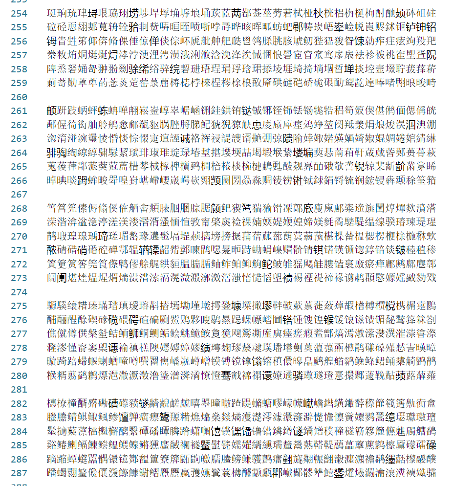

# 《通用规范汉字表》共收字8105个

此为《通用规范汉字表》校对版。
分为两个部分：
1. 原始列对应版   
2. 编码拓展版   

## 关于字形

部分字形使用繁体，囿于输入方法限制，使用的是输入法翻到的第一个字形，部分生僻字使用的是第二个字形，即看起来是简体的字形。  

## 编辑工具

编辑在Windows 10系统中进行。编辑器为VS Code和Notepad++。



### 切分用正则表达式示例
```vs code
(.{1}) --> $1\n

\n\n --> \n
```

## 处理后格式
```
字序号,Unicode,字面,分级,拼音(空格分隔多音字)
Z+0001,U+4E00,一,A,yī
```
分级：A B C 对应 一 二 三。   

拼音是从Unicode Unihan 数据库中提取的。

## 字表介绍

```
《通用规范汉字表》包括主表和附表两部分。

    主表共收8105字，分为三级：
    一级字表为常用字集，收字3500个，主要满足基础教育和文化普及的基本用字需要，也可以作为义务教育阶段的识字标准。
    二级字表收字3000个，常用度仅次于一级字。一、二级字表合计6500字，主要满足出版印刷、信息处理等方面和社会生活的一般用字需要。
    三级字表收字1605个，是姓氏人名、地名、科学技术术语和中小学语文教材文言文用字中未进入一、二级字表的较通用的字，主要满足与大众生活密切相关的专门领域的用字需要。

    附表有两个：《规范字与繁体字、异体字对照表》和《<通用规范汉字表>笔画检字表》。
```

## 参考
1. [国务院关于公布《通用规范汉字表》的通知, 国发〔2013〕23号](http://www.gov.cn/zwgk/2013-08/19/content_2469793.htm)
2. [教育部国家语委介绍《通用规范汉字表》研制情况, 2013年](http://www.gov.cn/jrzg/2013-08/27/content_2474971.htm)
3. [Unicode Han Database (Unihan) tr38](http://www.unicode.org/reports/tr38/)
